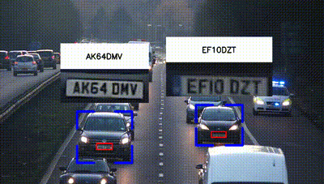

# Automatic Vehicle Identification Number Tracker

This project implements an Automatic Vehicle Identification Number using the YOLOv8 object detection algorithm in Python. It provides functionality to detect license plates in images and videos, along with utilities for processing and testing.

## Features

- License plate detection and tracking using YOLOv8.
- Utilities for image and video processing.

## Project Structure
```
├── README.md
├── model
│   ├── yolov8n.pt
    ├── license_plate.pt
├── sort
├── main.py
├── util.py
├── test.py
├── requirements.txt
├── results
    ├── test.gif
```

## Installation

1. Clone this repository:

    ```bash
    git clone https://github.com/jaigane6387/Automatic-VIN-Tracker
    ```

2. Navigate to the project directory:

    ```bash
    cd Automatic-VIN-Tracker
    ```

3. Install dependencies:

    ```bash
    pip install -r requirements.txt
    ```

## Usage

1. Run the main script `main.py` to perform car and license plate detection on a video.

    ```bash
    python main.py
    ```
    
2. Utilize the provided utilities in `utils.py` for additional processing or customization.

3. Evaluate the performance of the Automatic Vehicle Identification Number system using the test script `test.py`.

    ```bash
    python test.py
    
## Output    
<center></center></center>

## Tech Stack

<div align="left">
    
    
    
    
    
</div>

## Contributing

Contributions are welcome! Feel free to open issues or submit pull requests.

Note: If you like this repository, kindly give it a star and share it with your peers , lets explore cutting edge technologies together.


## Contact

Connect with me on social media platforms to stay updated on this project and more!

- Blogs: https://dataaspirant.com/author/jaiganesh-nagidi/
- LinkedIn: https://www.linkedin.com/in/jai-ganesh-nagidi/
- Kaggle: https://www.kaggle.com/jaiganeshnagidi
